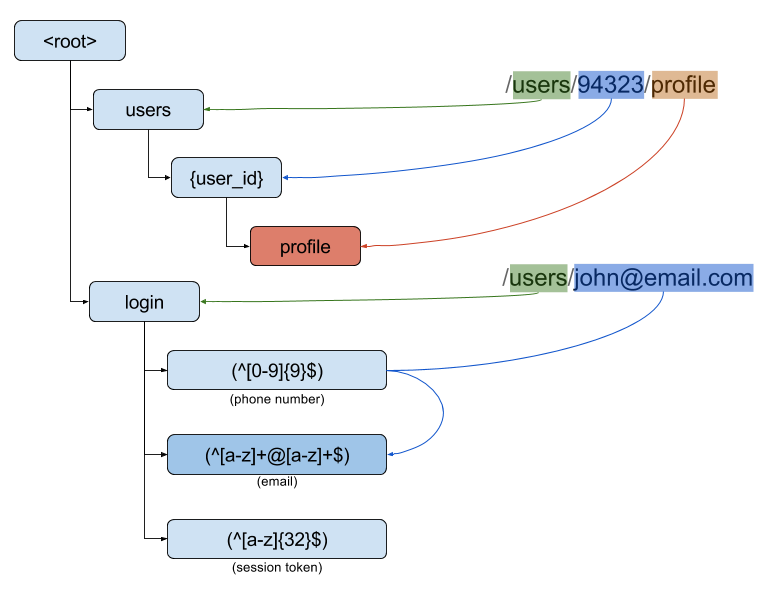
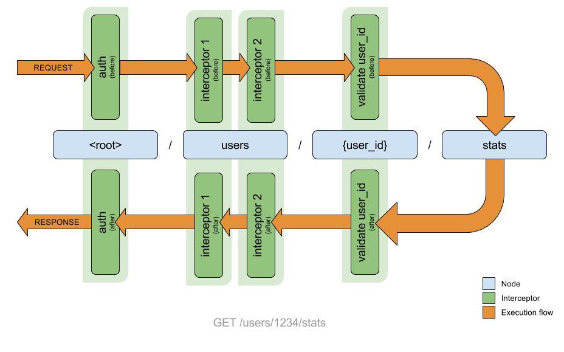
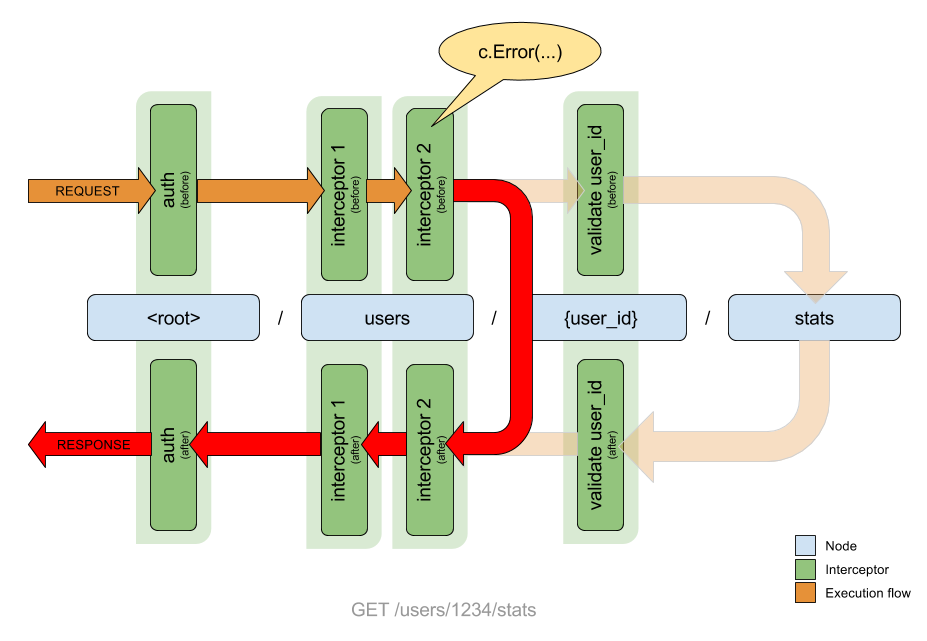

<p align="center">
<a href="https://travis-ci.org/fulldump/golax"></a>
<a href="https://goreportcard.com/report/fulldump/golax"></a>
<a href="https://godoc.org/github.com/fulldump/golax"></a>
</p>

Golax is the official go implementation for the _Lax_ framework.

<!-- MarkdownTOC autolink=true bracket=round depth=4 -->

- [About Lax](#about-lax)
- [Getting started](#getting-started)
- [Routing example](#routing-example)
- [Performance](#performance)
- [How interceptor works](#how-interceptor-works)
- [Handling parameters](#handling-parameters)
- [Sample use cases](#sample-use-cases)

<!-- /MarkdownTOC -->

Related docs:

* [Developer notes](doc/developer.md)
* [TODO list](doc/todo.md)

## About Lax

Lax wants to be the best _"user experience"_ for developers making REST APIs.

The design principles for _Lax_ are:

* The lowest language overhead
* Extremely fast to develop
* Very easy to read and trace.


## Getting started

```go
my_api := golax.NewApi()

my_api.Root.
    Interceptor(golax.InterceptorError).
    Interceptor(myLogingInterceptor)

my_api.Root.Node("hello").
    Method("GET", func(c *golax.Context) {
        // At this point, Root interceptors has been already executed
        fmt.Fprintln(c.Response, "Hello world!")
    })

my_api.Serve()
```

## Routing example

Routing is based on nodes.

<p align="center">
    
</p>

There are three types: `static`, `regex` and `parameter`.

* static: Only matches with the url part if it is exactly the same.
* regex: Surrounded by `(` and `)`, if the regex match.
* parameter: Surrounded by `{` and `}`, always matches.

## Performance

The performance compared with the [most popular alternative](http://www.gorillatoolkit.org/) is very similar (actually _golax_ performs slightly better) however code readability and maintainability is far better with _golax_ implementation.

<p align="center">
    
</p>

Tests has been executed in a `Intel(R) Core(TM) i5-3210M CPU @ 2.50GHz`.

Learn more about this https://github.com/fulldump/golax-performance.

## How interceptor works

If I want to handle a `GET /users/1234/stats` request, all interceptors in nodes from `<root>` to `.../stats` are executed:



To abort the execution, call to `c.Error(404, "Resource not found")`:



## Handling parameters

```go
my_api := golax.NewApi()

my_api.Root.
    Node("users").
    Node("{user_id}").
    Method("GET", func (c *golax.Context) {
        fmt.Fprintln(c.Response, "You are looking for user " + c.Parameter)
    })

my_api.Serve()
```

## Sample use cases

TODO: put here some examples to cover cool things:

* parameters
* fluent implementation
* node cycling
* readability
* node preference
* sample logging interceptor
* sample auth interceptor
* sample api errors
